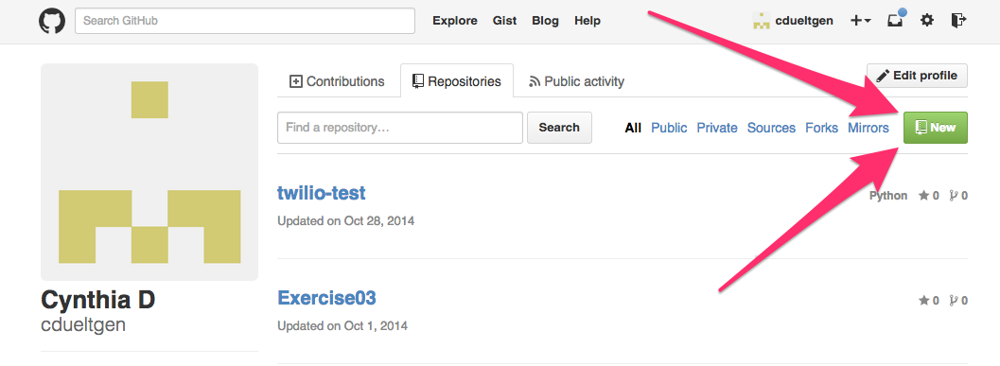
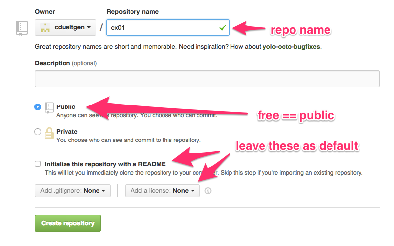
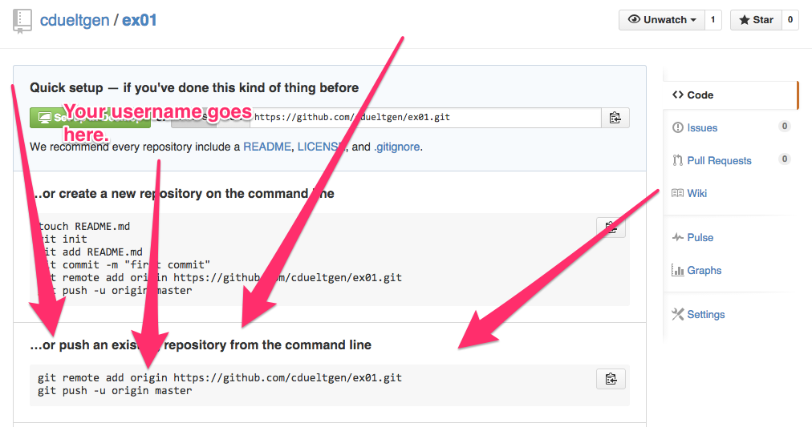
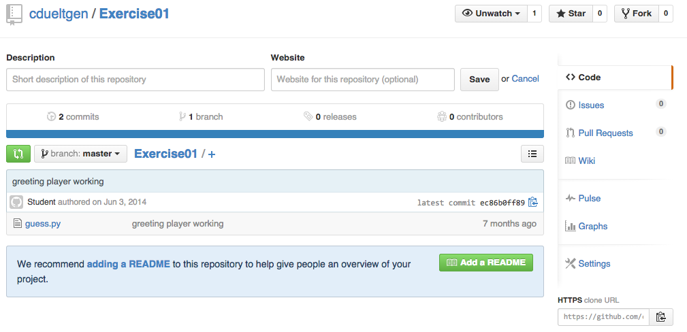

====================================
GitHub: Version Control in the Cloud
====================================

FIXME
=====

How GitHub Is Normally Used
---------------------------

.. jdigraph:: normalgit
  :revealjs: -Gsize=7,4!

  gh [label=<<B>GitHub</B> "ubermelon/website.git"> shape="doubleoctagon"];
  jessica [label=<Jessica ~/<I>uber-website</I>> shape="folder"];
  jane [label=<Jane <I>~/website</I>> shape="folder"];
  jamie [label=<Jamie <I>~/projects/website</I>> shape="folder"];
  jamie -> gh [label=<"origin"> dir="both"];
  jane -> gh [label=<"origin"> dir="both"];
  jessica -> gh [label=<"origin"> dir="both"];

- Many developers working on the same project

- Each in a distinct working directory (on a distinct laptop)

How We'll Use GitHub at Hackbright
----------------------------------

.. jdigraph:: hbgit
  :revealjs: -Gsize=8,4!

  gh [label=<<B>GitHub</B> "jane/lists-exercise.git"> shape="doubleoctagon"];
  gh2 [label=<<B>GitHub</B> "jessica/lists-exercise.git"> shape="doubleoctagon"];
  pair [label=<HB Lab Machine <I>~/src/lists-exercise</I>> shape="folder"];
  pair -> gh [label=<"jane"> dir="both"];
  pair -> gh2 [label=<"jessica"> dir="both"];

- One working directory (paired workstation!)

- You both want to have in your own GitHub

Version Control in the Cloud
============================

Why Do We Use Version Control?
------------------------------

- Track changes
- Look at older revisions
- Revert to early revision
- Share code/collaborate easily
- :incremental-li:`Save your bacon when you break something`

Git is a program, GitHub is a company
-------------------------------------

If you take nothing else away from this, make it that.

.. newslide::

GitHub is website that allows you to store your local repository in the cloud.

.. newslide::

In order to put your local repository in the cloud, you need to make a "remote".

Example time!
=============

Step 1: Log in to your GitHub account
-------------------------------------

and go to the Repositories tab

.. image:: repo_tab.png

Step 2: Create a new repo
-------------------------

Step 3: Give it a name
----------------------

Rinse. Repeat.
--------------

Do this for both members of your pair before you move on. An incognito window
is great for logging in to both GitHub accounts at the same time.

Step 4: Connect your new remote
-------------------------------

.. newslide::

Because we are sharing one local repo to two remotes, use your GitHub login instead of "origin".

.. parsed-literal::
  :class: console

  $ `git remote add cdueltgen https://github.com/cdueltgen/ex01.git`:cmd:
  $ `git remote add joelburton https://github.com/joelburton/exercise01.git`:cmd:
  $ `git push cdueltgen master`:cmd:
  $ `git push joelburton master`:cmd:

Step 5: Keep Working!
---------------------

- Push will push ALL your commits to the remote
- Push when you're going to be away from your computer
- Push when you need to move to a different computer

Woohoo! It worked! Now What?
============================

Let's look around
-----------------

Clone it to a new location
--------------------------

Look for the bit in the lower right that says "HTTPS clone URL" and hit the clipboard icon to copy it to your clipboard.

.. parsed-literal::
  :class: console

  $ `git clone https://github.com/cdueltgen/Exercise01.git`:cmd:

This will create a new Working Directory called, in this case, Exercise01.

Gotchas
-------

- Don't clone into an existing working directory (git status, amirite?)
- Only need to clone once in a given location
- git clone sets up the necessary remote for you, but calls it "origin"
- Your code is now public

.. newslide::

- To check what git thinks the remote(s) is(are):

.. parsed-literal::
  :class: console

  $ `git remote -v`:cmd:

Editing files on GitHub
-----------------------

BE CAREFUL!

If you edit a file on GitHub (you clicked on that tempting green button that
says "add a README", didn't you?), you must keep that in sync with your local
copy (your Working Directory).

Go to your local Working Directory and

.. parsed-literal::
  :class: console

  $ `git pull`:cmd:

.. newslide::

Try not to edit code on GitHub. This can cause something called a Merge Conflict. Keep your local and remote in sync as much as possible.

Congratulations!
----------------

You are now a git and GitHub master. Go forth and git.
